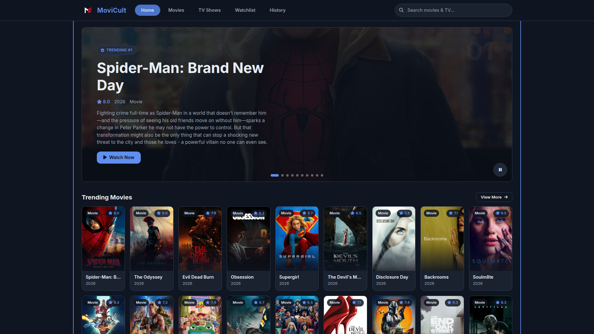

# MoviCult

A modern, responsive movie and TV show streaming web application built with vanilla JavaScript. Browse trending titles, search content, watch trailers, and stream with reliable multi-server playback.

[](LICENSE)
[](https://developer.mozilla.org/en-US/docs/Web/JavaScript)
[](https://developer.mozilla.org/en-US/docs/Web/HTML)
[](https://developer.mozilla.org/en-US/docs/Web/CSS)
[](https://www.themoviedb.org/documentation/api)

## Screenshot



## Features

- **Home Dashboard** — Trending movies & TV shows with interactive hero carousel
- **Browse Movies & TV Shows** — Paginated grids with infinite scroll, sorted by popularity and ratings
- **Real-time Search** — Instant suggestions with debounced TMDB multi-search
- **Title Details** — Comprehensive info: cast, genres, runtime, trailers, similar titles, collections
- **Multi-Server Player** — Automatic fallback across 4+ streaming providers (2embed, apiplayer, multiembed, vidsrc)
- **Fully Responsive** — Mobile-first design: 3-column grid on mobile, adaptive layouts up to 1440px
- **Keyboard Accessible** — Full keyboard navigation, ARIA labels, focus management
- **Modern UI** — Dark theme, smooth animations, skeleton loaders, shimmer effects
- **Performance** — Lazy-loaded images, intersection observers, view caching, DNS prefetch
- **SEO Ready** — Semantic HTML, Open Graph/Twitter cards, JSON-LD structured data, sitemap.xml

## Tech Stack

| Category | Technologies |
|----------|-------------|
| **Core** | Vanilla JavaScript (ES6+), HTML5, CSS3 |
| **Styling** | CSS Custom Properties, Flexbox, CSS Grid, Inter font |
| **Icons** | Font Awesome 6.5 |
| **API** | [TMDB (The Movie Database)](https://www.themoviedb.org/documentation/api) |
| **Streaming Providers** | 2embed, apiplayer, multiembed, vidsrc |
| **Deployment** | Vercel / Netlify / GitHub Pages (static hosting) |

## Quick Start

### Prerequisites

- Modern web browser (Chrome 80+, Firefox 75+, Safari 14+, Edge 80+)
- TMDB API Key — Get one free at [themoviedb.org/settings/api](https://www.themoviedb.org/settings/api)

### Installation

```bash
git clone https://github.com/aluukill/MoviCult.git
cd MoviCult
```

Edit `config.js` and replace the `tmdbKey` value with your API key.

### Running Locally

Serve with any HTTP server:

```bash
# Python 3
python -m http.server 8000

# Node.js
npx http-server -p 8000

# PHP
php -S localhost:8000
```

Open `http://localhost:8000` in your browser.

## Project Structure

```
MoviCult/
├── index.html          # Main HTML entry point
├── app.js              # Routing, navigation, app bootstrap
├── views.js            # UI rendering, components, state management
├── player.js           # Video player, provider management, fallback logic
├── api.js              # TMDB API wrapper, image helpers
├── config.js           # Configuration (API keys, providers, constants)
├── styles.css          # Complete stylesheet (CSS custom properties, responsive)
├── logo.png            # App logo / favicon
├── screenshot.png      # Preview screenshot
├── sitemap.xml         # SEO sitemap
├── robots.txt          # Crawler directives
├── LICENSE             # MIT License
└── README.md           # This file
```

## Configuration

### Streaming Providers (`config.js`)

Add, remove, or reorder providers in the `providers` object. Each provider needs a `name` and a `build` function returning the embed URL.

```javascript
providers: {
  movie: [
    { name: "Custom", build: (id) => `https://custom.com/movie/${id}` }
  ],
  tv: [
    { name: "Custom", build: (id, s, e) => `https://custom.com/tv/${id}/${s}/${e}` }
  ]
}
```

### Timeouts

| Constant | Default | Description |
|----------|---------|-------------|
| `providerCheckTimeout` | 6000ms | Max time to verify provider reachability |
| `providerLoadTimeout` | 10000ms | Max time to wait for iframe load before fallback |

## Routes

| Route | Description |
|-------|-------------|
| `#/` | Home — Trending carousel + categorized rows |
| `#/movies` | All movies grid (popular) |
| `#/series` | All TV shows grid (popular) |
| `#/search/{query}` | Search results |
| `#/title/{type}/{id}` | Title details (cast, trailer, similar) |
| `#/watch/{type}/{id}[/{season}/{episode}]` | Video player |

## Keyboard Shortcuts

| Key | Action |
|-----|--------|
| `Esc` | Close mobile menu / search panel |
| `Tab` | Navigate focusable elements |
| `Enter` / `Space` | Activate focused card/button |
| `←` / `→` | Hero carousel navigation |
| `↑` / `↓` | Search suggestions / dropdown navigation |

## Security & Privacy

- No user data collected — No authentication, no tracking, no cookies
- Client-side only — All API calls made directly from browser to TMDB
- Referrer policy — `origin` on player iframes
- CSP compatible — No inline scripts/styles (except JSON-LD)
- HTTPS enforced — All external resources loaded over HTTPS

## License

MIT License — see [LICENSE](LICENSE) for details.

## Contributing

1. Fork the repository
2. Create a feature branch: `git checkout -b feature/amazing-feature`
3. Commit changes: `git commit -m 'Add amazing feature'`
4. Push to branch: `git push origin feature/amazing-feature`
5. Open a Pull Request

## Acknowledgments

- [The Movie Database (TMDB)](https://www.themoviedb.org/) for the comprehensive movie/TV API
- [Font Awesome](https://fontawesome.com/) for the icon set
- [Inter Font](https://rsms.me/inter/) by Rasmus Andersson
- Streaming providers: 2embed, apiplayer, multiembed, vidsrc

## Support

- **Issues**: [GitHub Issues](https://github.com/aluukill/MoviCult/issues)
- **Discussions**: [GitHub Discussions](https://github.com/aluukill/MoviCult/discussions)